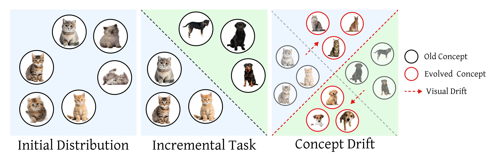

# Holistic Continual Learning under Concept Drift
_A framework for representation-level drift simulation &nbsp;•&nbsp; Adaptive Memory Realignment (AMR)_

  

## Overview
Traditional continual-learning methods focus on catastrophic-forgetting mitigation and assume that once a class is learned its distribution remains stationary. Our **Concept-Drift (CD) framework** removes this assumption by:

* Injecting configurable representation-level drift into standard benchmarks &nbsp;(`*-CD` datasets)
* Detecting drift online
* Realigning the replay buffer via **Adaptive Memory Realignment (AMR)** instead of expensive full retraining

  

## Features
| Component | Description |
|-----------|-------------|
| **Drift simulator** | Adds `n_drift` events of tunable `drift_severity` on Fashion-MNIST, CIFAR-10, CIFAR-100, and Tiny-ImageNet. |
| **Drift detector** | Lightweight KS-based monitor on uncertainty scores. |
| **AMR** | Selectively evicts outdated samples and resamples drifted classes—minimal labelled data & compute. |
| **Plug-and-play** | Works with ER, ER-ACE, DER++, SER, CLS-ER |

## Setup

+ Use `./utils/main.py` to run experiments.
+ Use argument `--load_best_args` to use the best hyperparameters from the paper
+ Check `./utils/best_args.py` for hyperparameters to reproduce results reported in the paper
+ New models can be added to the `models/` folder.
+ New datasets can be added to the `datasets/` folder.

## Models

+ Experience Replay (ER)
+ Experience Replay with Asymmetric Cross-Entropy (ER-ACE)
+ Dark Experience Replay++ (DER++)
+ Strong Experience Replay (SER)
+ Complementary Learning System-based Experience Replay (CLS-ER)

## Datasets

+ Sequential-Fashion-MNIST-CD
+ Sequential-CIFAR-10-CD
+ Sequential-CIFAR-100-CD
+ Sequential-Tiny-ImageNet-CD

## Quick Start

Run an experiment with a single command:

`python utils/main.py --model er --dataset seq-cifar10 --n_epochs 50 --lr 0.1 --batch_size 10 --minibatch_size 10 --buffer_size 5000 --nowand 1 --non_verbose 1 --ignore_other_metrics 1 --seed 42 --concept_drift 5 --drift_severity 5 --drift_adaptation 2 --n_drifts 1`

### Command-line Flags (overview)

* **`--dataset`** &nbsp;  
  *Required.* Benchmark to use:  
  `seq-fashionmnist`, `seq-cifar10`, `seq-cifar100`, or `seq-tinyimg`.

* **`--model`** &nbsp;  
  *Required.* Rehearsal strategy to use:
  `er`, `er-ace`, `der++`, `ser`, `cls-er`

* **`--buffer_size`** &nbsp;  
  *Required.* Size of the replay memory (e.g., `500` or `5000`).

* **`--concept_drift`** &nbsp;  
  Optional, default `-1` (random). Transformation applied to drifted data:  
  `0` Defocus Blur · `1` Gaussian Noise · `2` Shot Noise · `3` Speckle Noise · `4` Rotation · `5` Pixel Permutation · `6` Identity (no transform).

* **`--drift_adaptation`** &nbsp;  
  Optional, default `0`. Strategy after drift detection:  
  `0` No adaptation · `1` Naive full retraining · `2` Adaptive Memory Realignment (AMR).

* **`--drift_severity`** &nbsp;  
  Optional, default `1`. Intensity of the chosen drift transform (`1–5`).

* **`--n_drifts`** &nbsp;  
  Optional. Number of drift events to inject (e.g., `1`, `2`, `4`). Events are spaced evenly across the task stream.

* **`--max_classes_per_drift`** &nbsp;  
  Optional, default `0`. Maximum number of previous classes that drift simultaneously. `0` means all prior classes drift.

* **`--sequential_drifts`** &nbsp;  
  Optional flag. When set, each new task contains both new classes and drifted versions of classes from the immediately preceding task.
